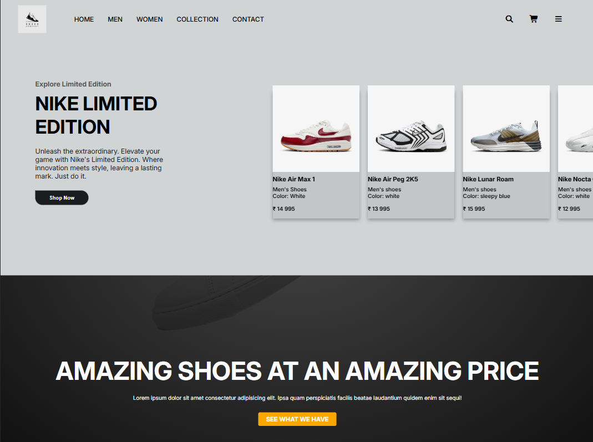

# 🌐 Landing Page – Reskilling Journey Project

This landing page is part of my **6-month reskilling journey** where I’m building real-world projects to strengthen my **Full Stack + DevOps skills**.

---

## 🖼️ Preview  

## 📌 About This Project

* ✅ Built as a **foundational frontend project** in my reskilling roadmap
* 🎨 Focused on **UI/UX design, responsiveness, and clean code**
* 🚀 Will serve as a base for more advanced projects (React, Vue, DevOps integration)

---

## 🛣️ Next Steps in My 6-Month Roadmap

This project is the **second point** of my reskilling journey. Here’s what comes next:

1. 🟢 **Landing Page (Current)** – HTML, CSS
2. 🟡 **Portfolio Website** – Personal branding + multiple project showcases
3. 🔵 **Interactive Dashboard** – Vue/React + charts + real data
4. 🟣 **Full-Stack Web App** – React/Vue frontend + Node/Express backend + database
5. 🟠 **DevOps Integration** – Docker, CI/CD, Terraform, AWS deployment
6. 🔴 **Capstone Project** – End-to-end deployed application with full stack + DevOps

---

✨ Stay tuned as I keep updating this repo with my progress!
